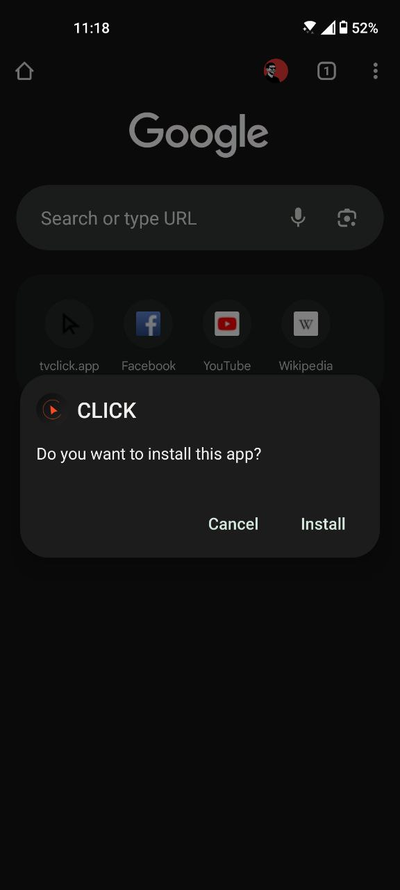
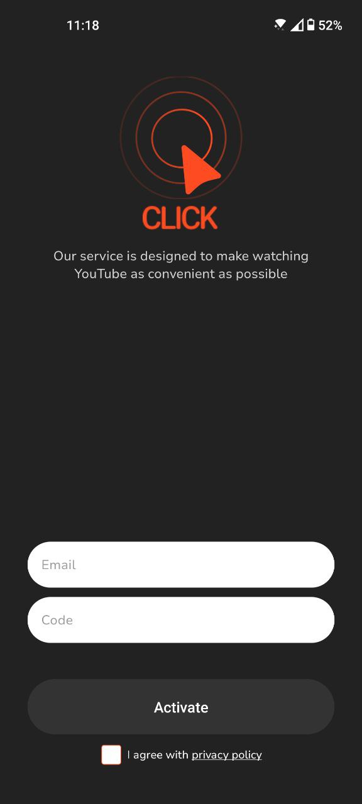
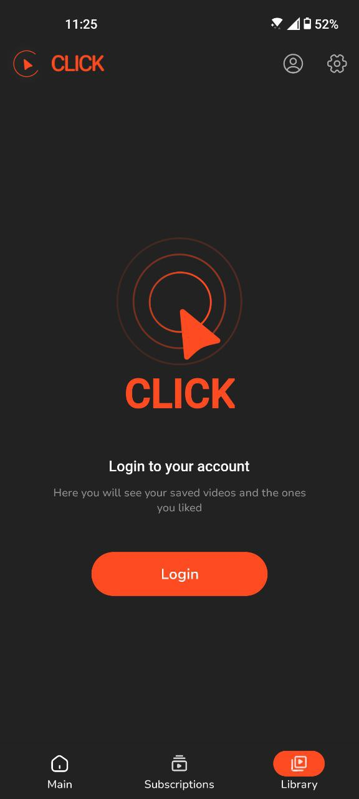

# Installing CLICK on Android

Download and install the app via **APK file** on your smartphone or tablet.

> The app is not available on Google Play. To learn why, read [this article](https://www.androidpolice.com/2016/03/01/google-explicitly-bans-ad-blockers-from-the-play-store-except-all-those-ad-blocking-web-browsers-apparently/).
>

If you have Google Play, here’s how to manually install CLICK for Android.

The latest version of the app is available on the [official website](https://myclick.app/app).

## Installation Steps

### For Android 9 and newer:

1. Tap on the downloaded CLICK APK file, then tap **Install**.  
2. If installation from the browser is not allowed, you will see a notification.  
   - In the notification, tap `Settings → Allow installation from this source → OK`, then reopen the installation file.  

Now, you can proceed with the installation. A prompt will appear asking to save the downloaded file.  
- Tap **OK**.

3. Once the download is complete, tap **Install** in the installation dialog box.  
4. Wait for the installation to finish and tap **Done**.

 

CLICK is now **installed**. To launch the app, tap its icon in the list of installed applications.

 

## Initial Setup

1. **Enable notifications** – This will allow you to receive update alerts.  

 

2. **Create an account** or use the same login credentials you used for activating CLICK on Smart TVs.  

 

3. **Sign in to your Google account** – Access your personalized recommendations, curated content, and watch your favorite subscribed videos.  

 
