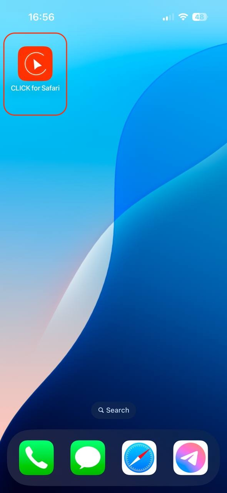

# Installing CLICK on iOS

Download and install the app via the App Store on your smartphone or tablet.

> The Safari extension for iOS is currently in testing mode and is available only for iPhone.

The latest version of the app is available on the [App Store](https://apps.apple.com/us/app/click-watch-video/id6740205263).

Go to the App Store and tap **Install**.

 

Once installed, the app is ready to use. To set it up, open the app by tapping its icon in the list of installed applications and follow the instructions.

 

 

## Enabling the Safari Extension

For the extension to work properly, it must be enabled in Safari settings:

1. Go to `Settings → Safari → Extensions → CLICK`  
2. Enable the necessary permissions.

 

 

## Using CLICK in Safari

1. Open Safari and go to **youtube.com**.  
2. Once the page loads, open the page settings menu (puzzle icon in the bottom left corner).  

 

3. Select **CLICK**.  

 

4. Enter your **login and password** in the authentication field.  

 

Once successfully logged in, you can use all the features of the CLICK app.

 

 

For quick access, you can add an icon to your desktop:

 

 

 

 