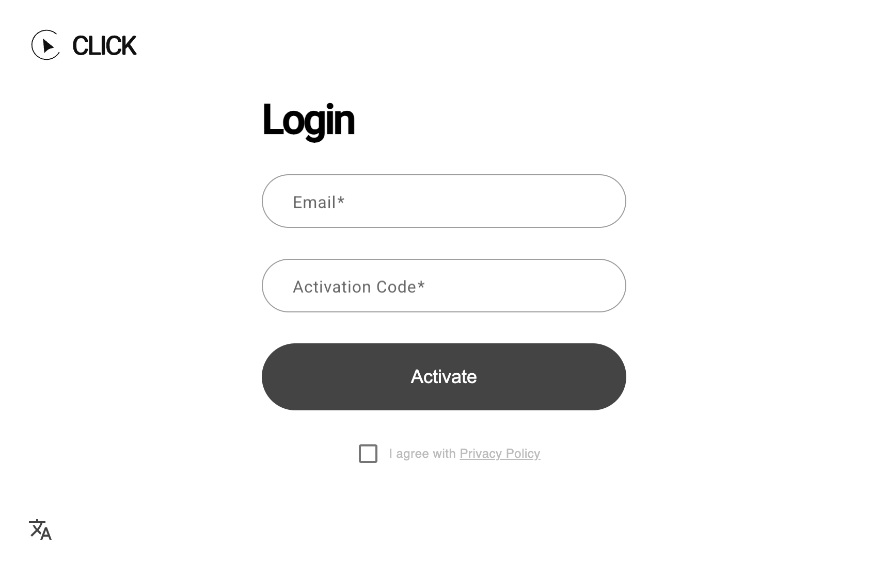
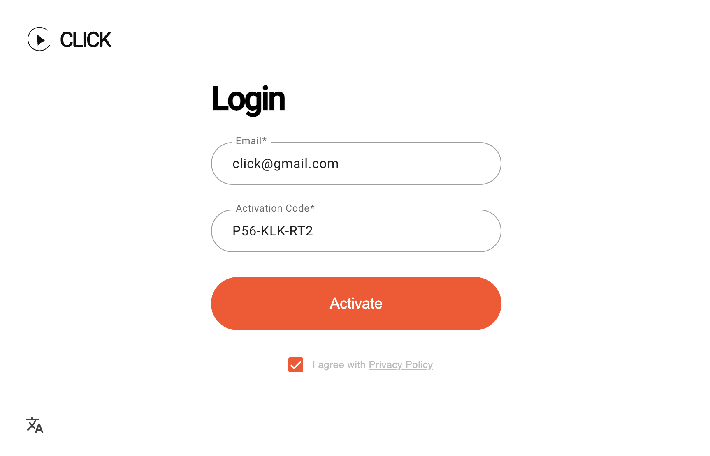
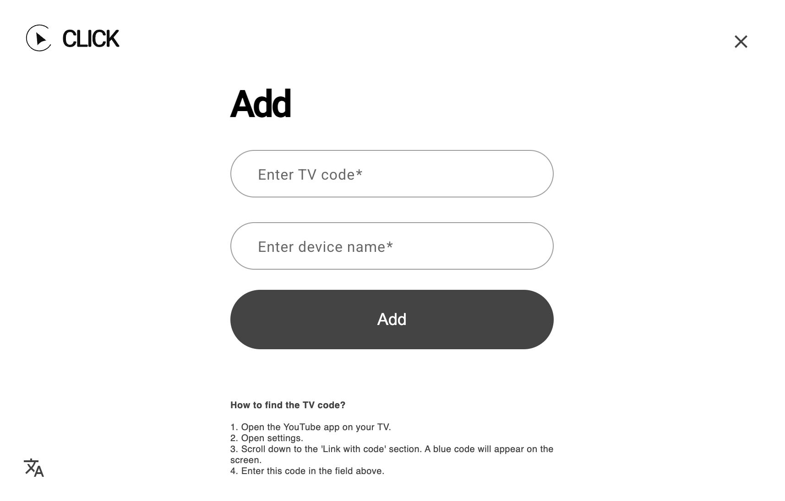
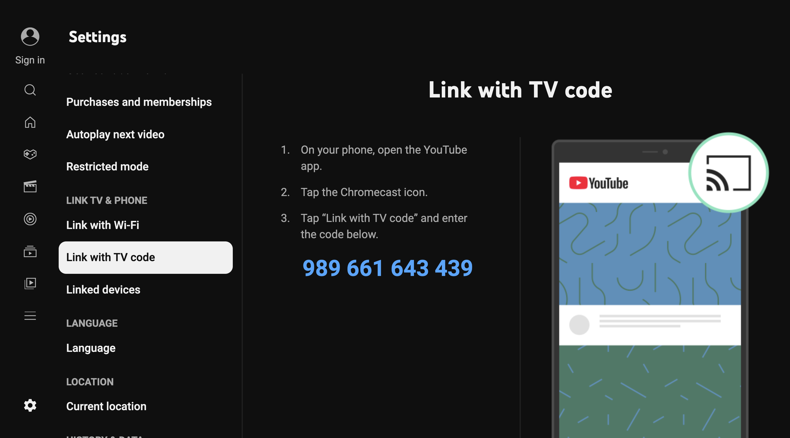
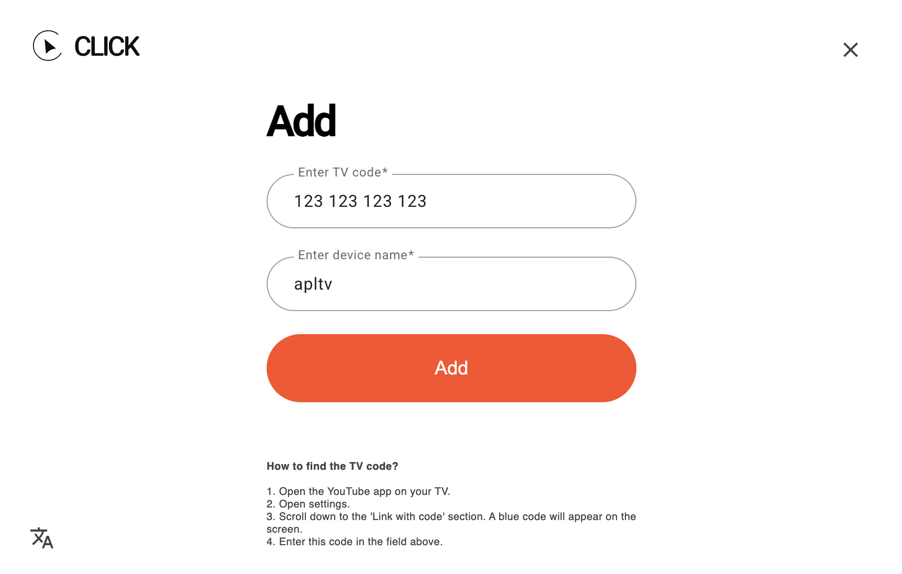
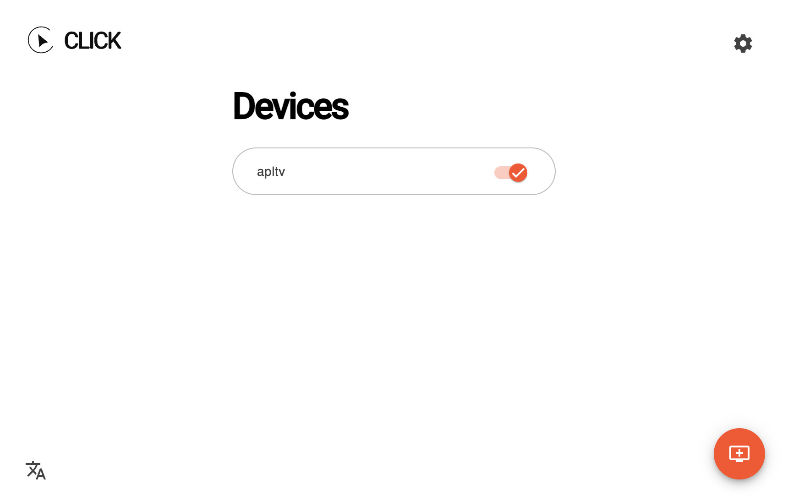

# Setting Up CLICK on Smart TVs

Go to [tvclick.app](https://tvclick.app/) and create an account,  
or use the same credentials you used for activating the Android app.

Enter your email. It does not have to match your Google account.

 

Enter your activation code and click **Activate**.

 

To add your TV, you need to enter a **code** and a **TV name**.

 

You can find the TV code in the **YouTube app on your TV**:  
`Settings → Settings → Connect using a Code`.  
A **blue code** will appear on the screen. This code changes every few minutes.

 

The TV name can be anything you choose.

Enter the code and TV name in the fields and click ***Add***.

 

CLICK is now **set up**.  
To remove or add a device, use your personal account on tvclick.app.

 

> You can add up to **three** devices (TVs, game consoles, TV boxes) in your account.