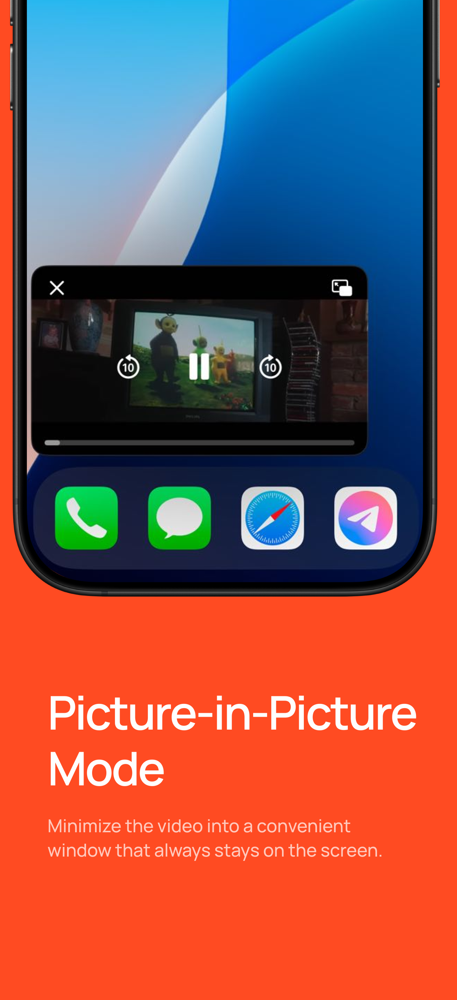

## Information

> This article covers CLICK for iOS — a multifunctional Safari extension that allows you to watch your favorite videos without ads or sponsored integrations on iPhone and iPad. To see how it works, download the [CLICK: Watch Video](https://apps.apple.com/us/app/click-watch-video/id6740205263) app.

 

## System Requirements

> * OS Version: iOS or iPadOS 15.0 or higher  

## Guides

- [Setup Guide](/install_ios.md)  

## Features

### *Ad-Free Experience*  
`Watch your favorite content without YouTube ads and skip sponsored integrations from creators.`  

### *Background & Picture-in-Picture Playback*  
`Listen to your favorite videos, music, and podcasts in the background.`  

### *No Sponsored Integrations*  
`Detects and removes sponsored integrations from videos.`  

## Usage  

### *Viewing Sponsored Integrations on the Timeline*  
To see sponsored segments on the timeline, tap the "Integrations" button.  
The ad sections will be highlighted in green.  

  

### *Using Picture-in-Picture Mode*  
To enable Picture-in-Picture mode, simply tap the corresponding icon.  

  

### *Background Playback*  
To play a video in the background:  
1. Start the video.  
2. Lock the screen – the video will pause automatically.  
3. Resume playback by pressing the play button on the lock screen.  

  

