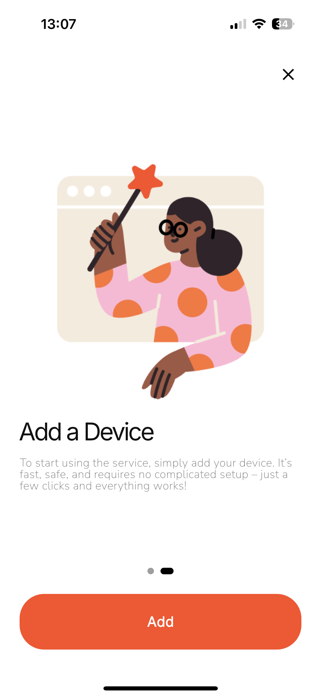
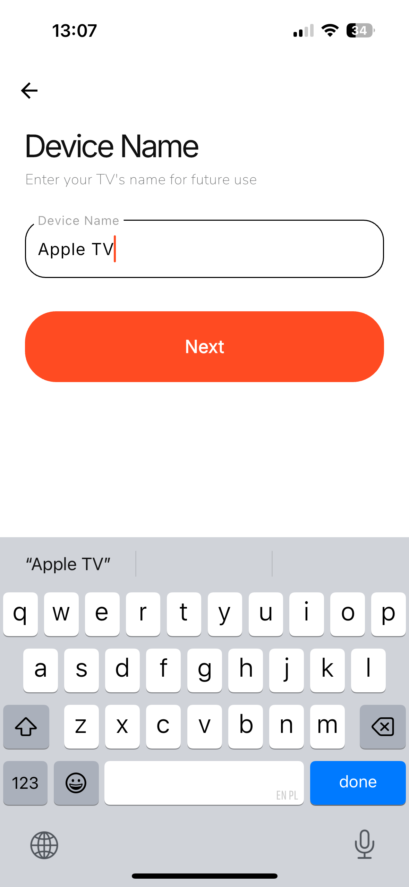
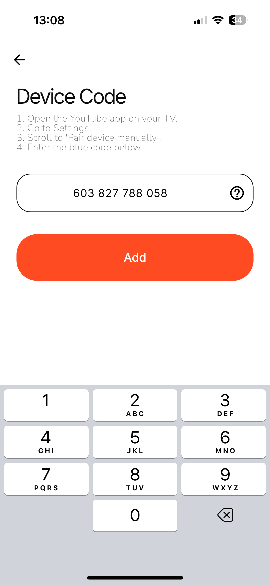
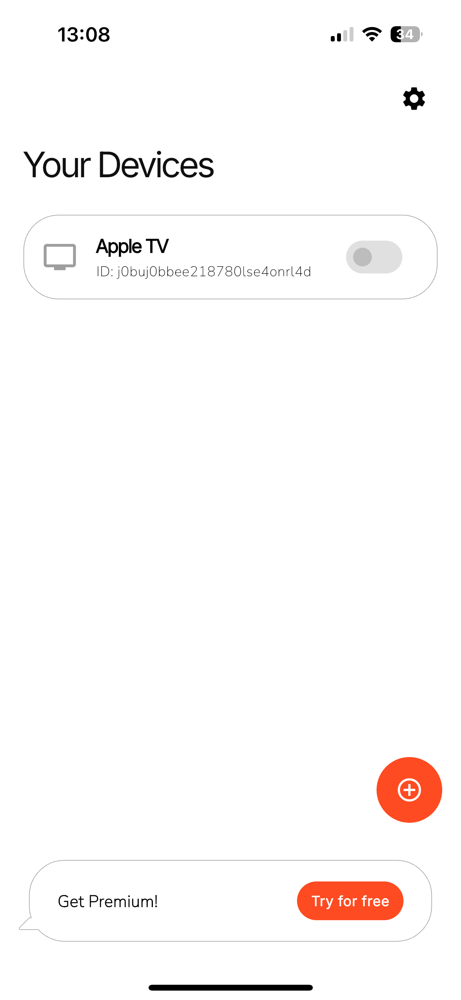
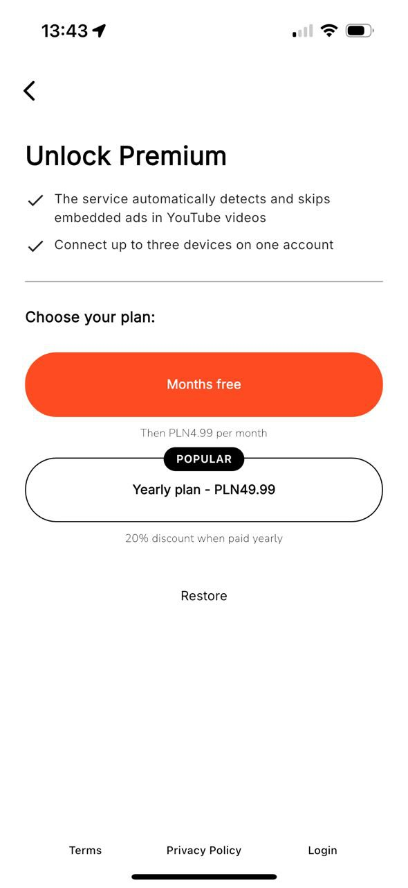
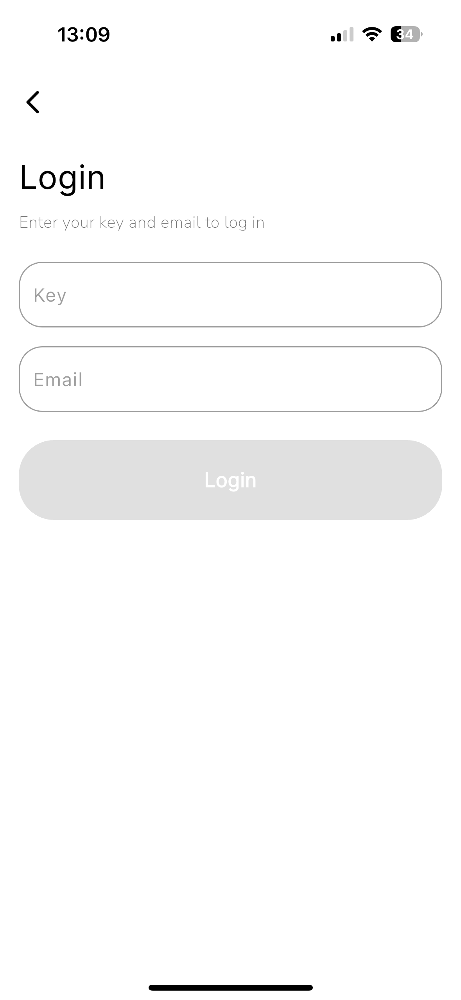
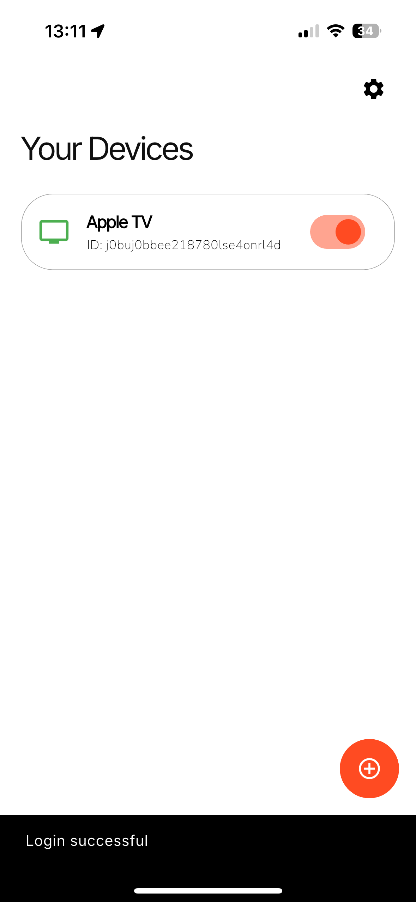

# 📱 Mobile App Setup

To start using the service on your TV via a mobile device, follow these steps:

---

## 1. Download and Open the App

Download the mobile app on your smartphone and launch it.

---

## 2. Tap the Add Device Button

On the **Your Devices** screen, tap the ➕ button in the bottom-right corner to start adding a new device.

---

## 3. Enter the Device Name

Type a name for your TV (e.g., `Apple TV`) and tap **Next**.

---

## 4. Enter the Code from the YouTube App

On your TV:

1. Open the **YouTube app**.
2. Go to **Settings**.
3. Scroll to **Pair device manually**.
4. Enter the **blue code** into the app and tap **Add**.

---

## 5. Device Added

Your device will now appear in the **Your Devices** list.  
If you’re on a free plan, only one device can be active.

---

# 🔓 Unlock Premium (Optional)

To unlock all features (such as multiple devices):

1. Tap **Get Premium**.
2. Choose your subscription plan:  
   - Free trial → then 4.99 PLN/month  
   - **Yearly plan** → 49.99 PLN (20% discount)
3. Complete the purchase.

---

# 🔑 Log into Your Account

To activate Premium on another device:

1. Tap **Login** at the bottom.
2. Enter your **Key** and **Email**.
3. Tap the **Login** button.

---

Once logged in, you’ll see **Login successful** and your Premium status will be enabled.

---

