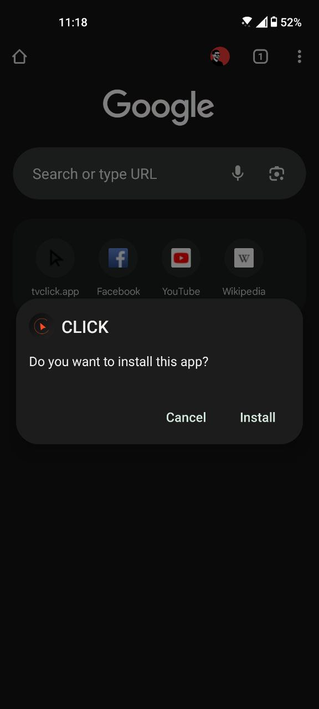
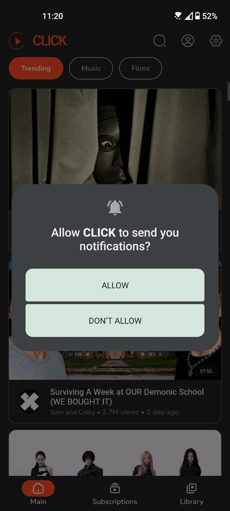
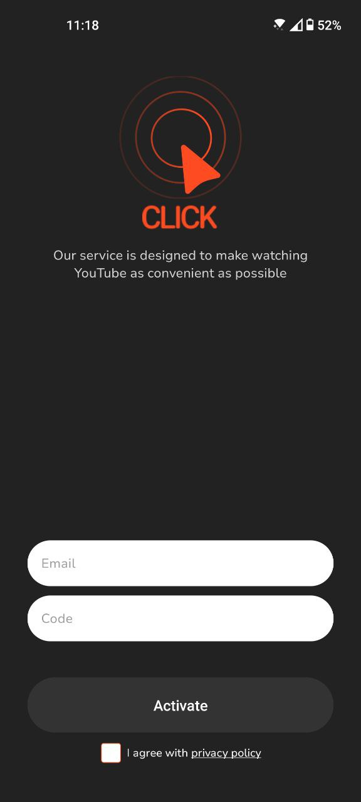

# Установка приложения CLICK для Android

Скачайте и установите приложение через APK-файл на смартфон или планшет.

В Google Play приложение найти нельзя. Почему это так, можно узнать [здесь](https://www.androidpolice.com/2016/03/01/google-explicitly-bans-ad-blockers-from-the-play-store-except-all-those-ad-blocking-web-browsers-apparently/). 

Если у вас Google Play, вот инструкция, как установить CLICK для Android вручную.

Актуальная версия доступна на [сайте](https://myclick.app/app)

Разрешите установку программ из сторонних источников в настройках операционной системы. В Android версии 8 и новее: нажмите на загруженный APK-файл CLICK, затем нажмите Установить. Если установка из браузера не разрешена, вы получите уведомление. В нём нажмите на Настройки → Разрешить установку из этого источника → ОК и откройте установочный файл.

Теперь можно приступить к установке программы. На экране отобразится предложение сохранить загружаемый файл. Нажмите кнопку ОК.

После завершения загрузки нажмите Установить в диалоговом окне установки. Дождитесь завершения установки и нажмите Готово.

CLIKC установлен. Чтобы запустить приложение, нажмите на его значок в списке установленных приложений.

Дайте разрешение на уведомления (позволит получать уведомление о обновлениях).

Создайте логин (почта) и активируйте код (или используйте креды из TV версии).

Зайдите в свой Google аккаунт (получите доступ к своим рекомендациям и подборкам, смотрите любимые видео из подписок).
