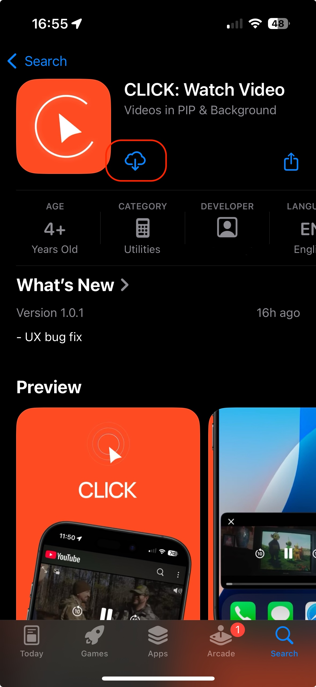

# Установка CLICK на iOS

Скачайте и установите приложение через App Store на ваш смартфон или планшет.

> Расширение для Safari iOS находится в режиме тестирования только для iOS.

Актуальная версия приложения доступна в [AppStore](https://apps.apple.com/us/app/click-watch-video/id6740205263).

Перейдите в AppStore и нажмите **Установить**. 

 

После установки приложение будет готово к использованию. Для настройки откройте приложение, нажав на его значок в списке установленных приложений, и следуйте инструкциям.

 

 

Для полноценной работы расширения нужно включить его в настройках Safari. Перейдите в `Настройки - Safari - Расширения`, и разрешите необходимые параметры.

 

 

После настройки откройте **Safari*** и перейдите на сайт youtube.com.

 

Как только страница загрузится, откройте меню настроек страницы (значок в виде пазла в нижнем левом углу).

 

Перейдите в CLICK.

 

Введите ваш логин и пароль в поле авторизации.

 

После успешной авторизации вы сможете использовать все функции приложения CLICK.

 

