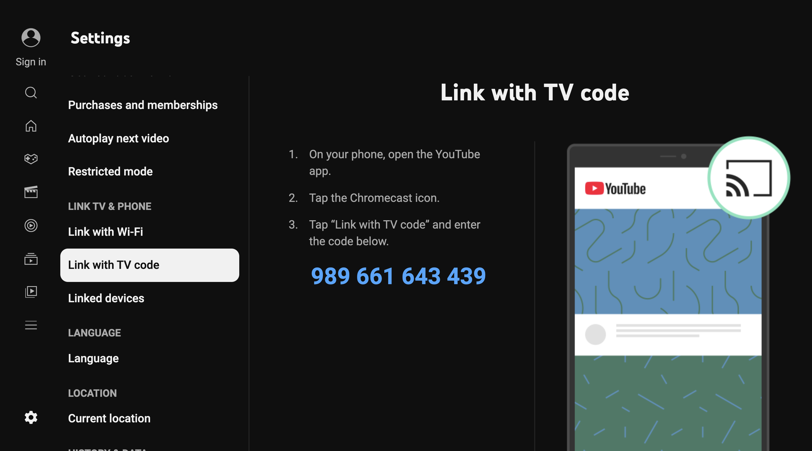

# Настройка CLICK на телевизорах

Перейди на сайт [tvclick.app](https://tvclick.app/), создайте аккаунт (Ваша электронная почта) и код активации (или используйте данные которые Вы использовали при активации Android приложения).


<p align="center"></p> 

Ввести почту. Почта может быть любая, она не обязательна должна совпадать с вашим Google аккаунтом.

<p align="center"></p> 

Ввести код активации и активировать.

<p align="center"></p> 

Для добавления вашего телевизора небходимо ввести ***код*** и ***название телевизора***. 

<p align="center"></p> 

Код телевизора можно узнать в ***приложении YouTube на вашем телевизоре***, Настройки → Настройки →  Подключение с помощью Кода. На экране появится код ***синего цвета***. Этот код меняется каждые несколько минут.

<p align="center"></p> 

Название телевизора может быть любым.

Введите этот код и название в поля и нажмите кнопку ***Добавить***.
CLIKC **настроен**. Чтобы удалить или добавить устройство, успользуйте tvclick.app и данный вашего аккаунта.

<p align="center"></p> 


```
В личном кабинете можно добавить до 3-х телевизоров.
```