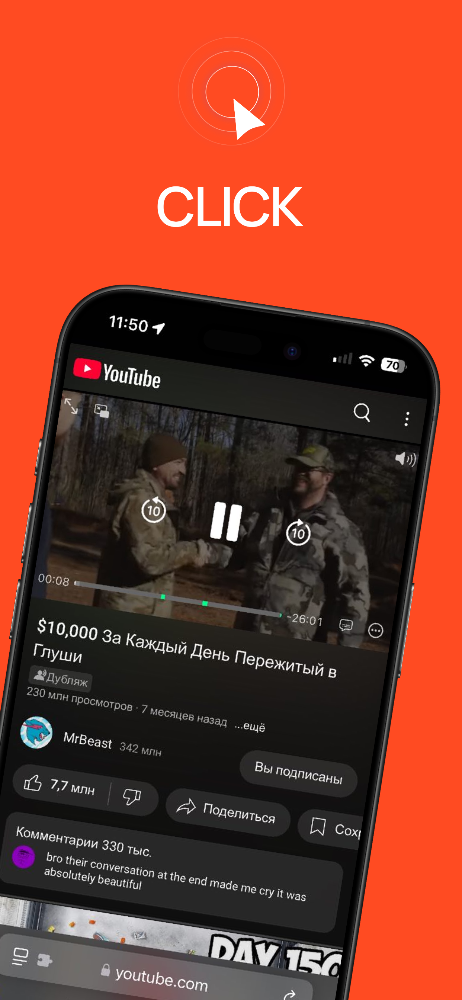

## Информация

> В этой статье рассказывается о CLICK для iOS — многофункциональном расширении для Safari, которое позволяет смотреть ваши любимые ролики без рекaламы и рекламных интеграций на iPhone и iPad. Чтобы увидеть, как он работает, скачайте приложение [CLICK: Watch Video](https://apps.apple.com/us/app/click-watch-video/id6740205263).

 

## Системные требования

> * Версия ОС: iOS или iPadOS 15.0 или выше

## Инструкции
- [Инструкция по настройке](/install_ios.md)

## Функции

* Без рекламы

`Смотрите любимый контент без рекламы от YouTube и наслаждайтесь пропуском рекламных интеграций от блогеров.`

* Просмотр в фоне и "Окне в окне"

`Прослушивайте любимые видео, музыку и подкасты в фоновом режиме.`

* Без интеграций

`В роликах будут найдены и удалены рекламные интеграции от блогеров.`

