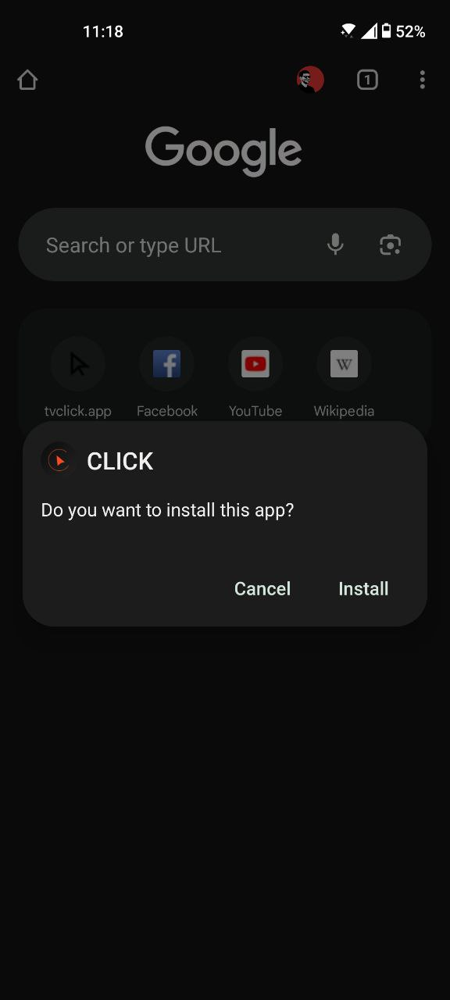

```markdown
# Instalacja CLICK na Androida

Pobierz i zainstaluj aplikację za pomocą **pliku APK** na smartfonie lub tablecie.

> Aplikacja nie jest dostępna w Google Play. Dlaczego? Dowiedz się więcej [tutaj](https://www.androidpolice.com/2016/03/01/google-explicitly-bans-ad-blockers-from-the-play-store-except-all-those-ad-blocking-web-browsers-apparently/).
>

Jeśli korzystasz z Google Play, oto instrukcja ręcznej instalacji CLICK dla Androida.

Najnowsza wersja aplikacji jest dostępna na [stronie internetowej](https://myclick.app/app).

## Instalacja

### Dla Androida 8 i nowszych:

1. Kliknij na pobrany plik APK CLICK, a następnie wybierz **Zainstaluj**.  
2. Jeśli instalacja z przeglądarki nie jest dozwolona, pojawi się powiadomienie.  
   - W powiadomieniu wybierz `Ustawienia → Zezwól na instalację z tego źródła → OK`, a następnie ponownie otwórz plik instalacyjny.  

Teraz możesz kontynuować instalację. Pojawi się komunikat z prośbą o zapisanie pobranego pliku.  
- Naciśnij **OK**.

3. Po zakończeniu pobierania kliknij **Zainstaluj** w oknie instalacyjnym.  
4. Poczekaj na zakończenie instalacji i wybierz **Gotowe**.

<p align="center"></p> 

CLICK **zainstalowany**. Aby uruchomić aplikację, kliknij jej ikonę na liście zainstalowanych aplikacji.

<p align="center"></p> 

## Konfiguracja początkowa

1. **Zezwól na powiadomienia** – umożliwia otrzymywanie informacji o aktualizacjach.  

<p align="center"></p> 

2. **Utwórz konto** lub użyj tych samych danych logowania, które zostały wykorzystane przy aktywacji CLICK na telewizorach.  

<p align="center"></p> 

3. **Zaloguj się na konto Google** – uzyskaj dostęp do swoich rekomendacji, list odtwarzania, subskrypcji i ulubionych filmów.  

<p align="center"></p> 
```