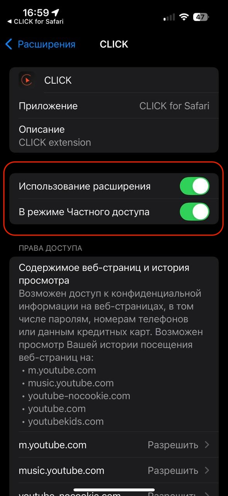
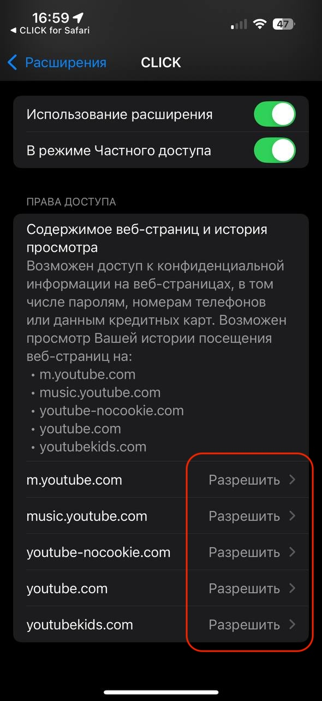

```markdown
# Instalacja CLICK na iOS

Pobierz i zainstaluj aplikację za pomocą App Store na swoim smartfonie lub tablecie.

> Rozszerzenie Safari dla iOS jest obecnie w fazie testowania i dostępne tylko dla iPhone'ów.

Najnowsza wersja aplikacji jest dostępna w [App Store](https://apps.apple.com/us/app/click-watch-video/id6740205263).

Otwórz App Store i kliknij **Zainstaluj**.

<p align="center"></p> 

Po instalacji aplikacja będzie gotowa do użycia. Aby ją skonfigurować, otwórz aplikację, klikając jej ikonę na liście zainstalowanych aplikacji, i postępuj zgodnie z instrukcjami.

<p align="center"></p> 
<p align="center"></p> 

## Włączenie rozszerzenia Safari

Aby rozszerzenie działało poprawnie, należy je aktywować w ustawieniach Safari:

1. Przejdź do `Ustawienia → Safari → Rozszerzenia → CLICK`.  
2. Włącz wymagane uprawnienia.

<p align="center"></p> 
<p align="center"></p> 

## Korzystanie z CLICK w Safari

1. Otwórz Safari i przejdź na **youtube.com**.  
2. Po załadowaniu strony otwórz menu ustawień strony (ikona puzzla w lewym dolnym rogu).

<p align="center"></p> 

3. Wybierz **CLICK**.

<p align="center"></p> 

4. Wprowadź swój **login i hasło** w polu logowania.

<p align="center"></p> 

Po pomyślnym zalogowaniu możesz korzystać ze wszystkich funkcji aplikacji CLICK.

<p align="center"></p> 
<p align="center"></p> 
```