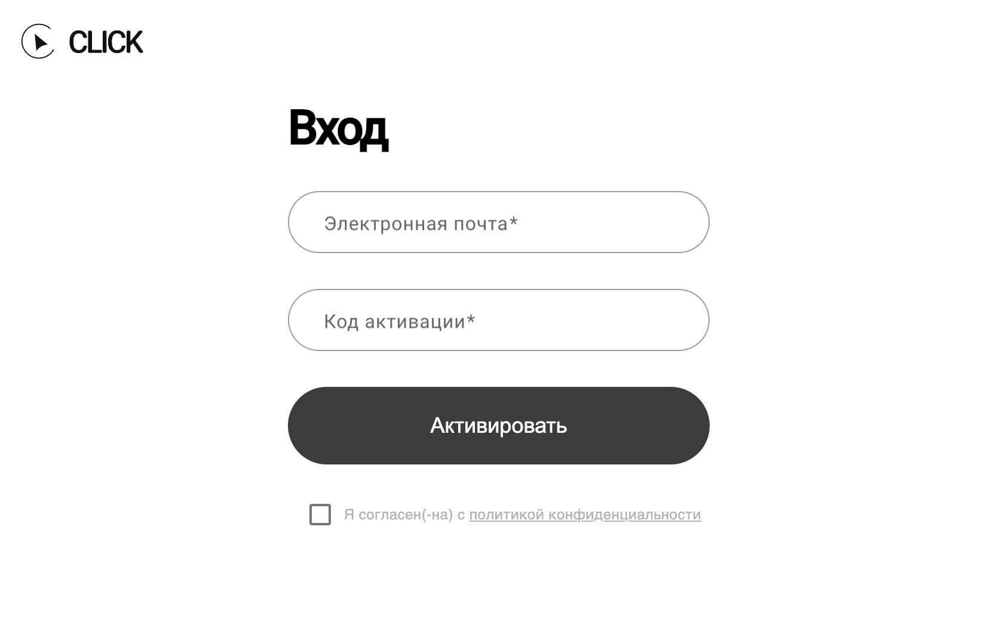
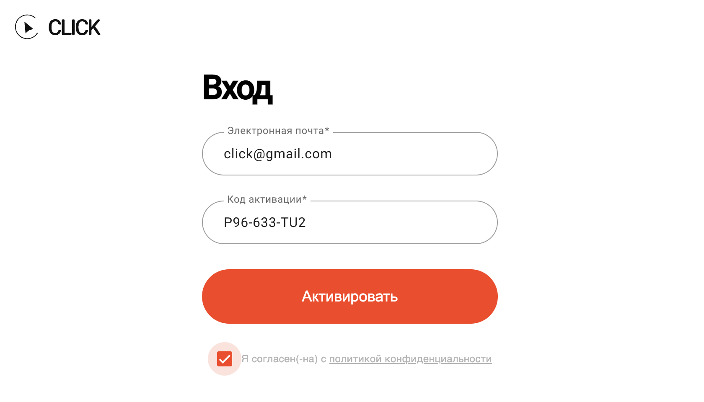
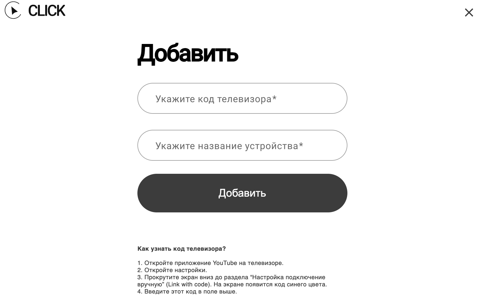
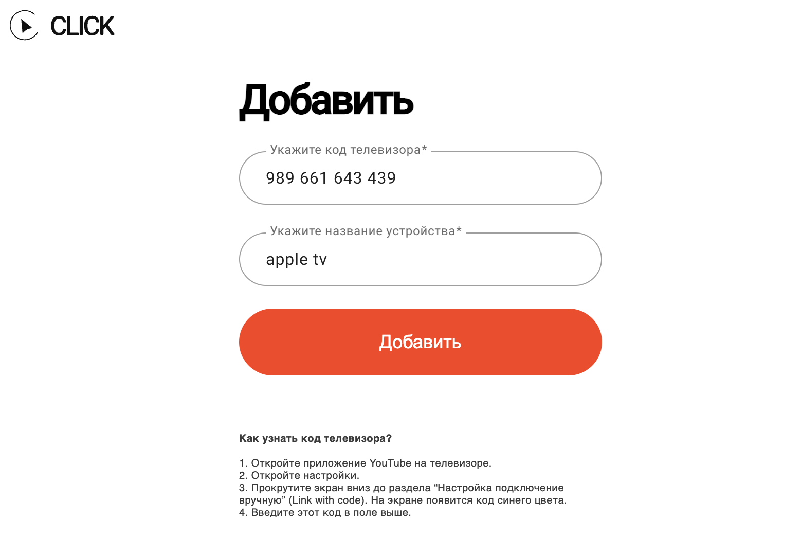
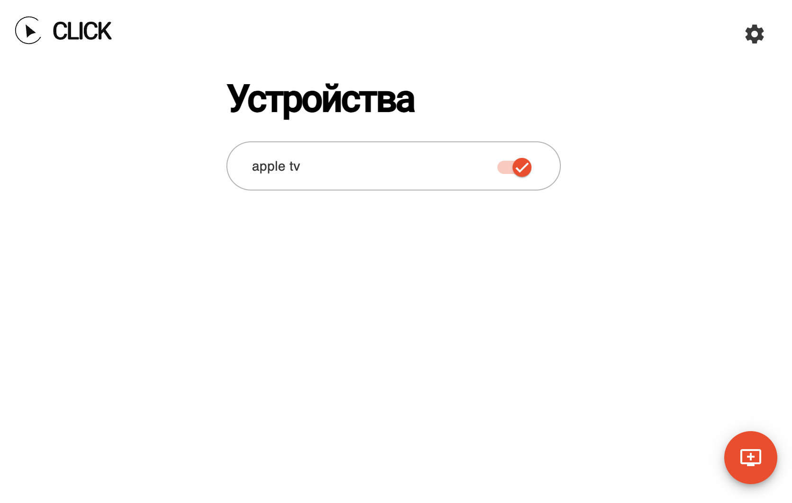

# Konfiguracja CLICK na telewizorach

Przejdź na stronę [tvclick.app](https://tvclick.app/), załóż konto  
`lub użyj danych logowania, które wykorzystałeś podczas aktywacji aplikacji na Androidzie`.

Wprowadź swój adres e-mail.  
Nie musi on być taki sam jak adres powiązany z Twoim kontem Google.

 

Wprowadź kod aktywacyjny i kliknij **Aktywuj**.

 

Aby dodać swój telewizor, wprowadź **kod** oraz **nazwę telewizora**.

 

Kod telewizora można znaleźć w **aplikacji YouTube na telewizorze**:  
`Ustawienia → Ustawienia → Połącz za pomocą kodu`.  
Na ekranie pojawi się **niebieski kod**, który zmienia się co kilka minut.

 

Nazwa telewizora może być dowolna.

Wprowadź kod oraz nazwę w odpowiednie pola i kliknij przycisk ***Dodaj***.

 

CLICK **jest skonfigurowany**.  
Aby dodać lub usunąć urządzenie, skorzystaj z panelu użytkownika na tvclick.app.

 

> W panelu użytkownika można dodać maksymalnie 3 urządzenia (telewizory, konsole do gier, przystawki TV).
