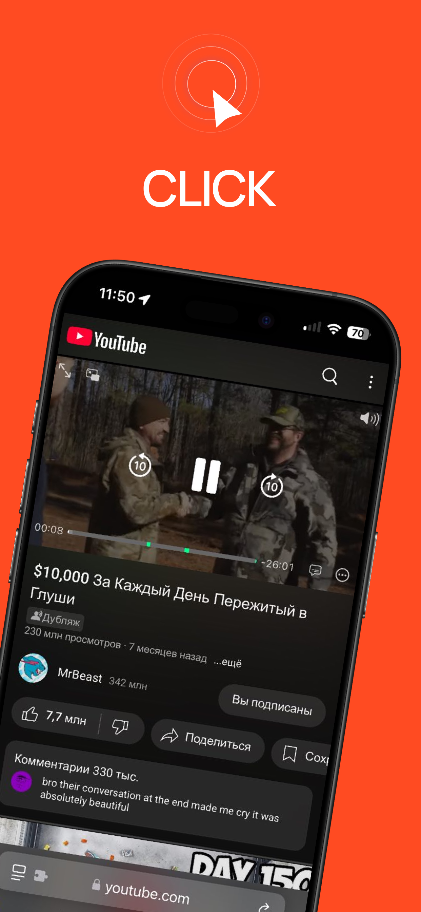
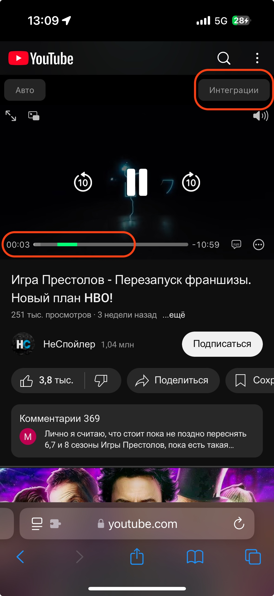
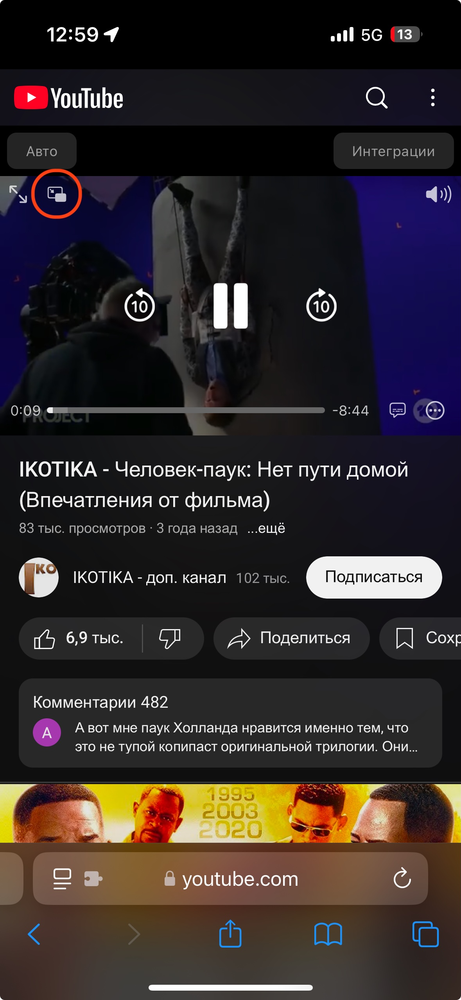
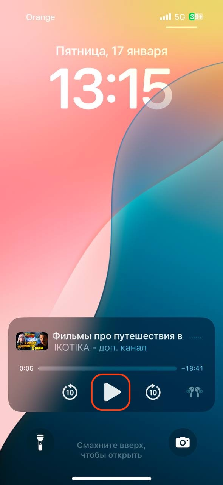

```markdown
## Informacje

> Ten artykuł dotyczy CLICK dla iOS — wielofunkcyjnego rozszerzenia dla Safari, które pozwala oglądać ulubione filmy bez reklam i sponsorowanych treści na iPhone i iPad.  
> Aby zobaczyć, jak działa, pobierz aplikację [CLICK: Watch Video](https://apps.apple.com/us/app/click-watch-video/id6740205263).

<p align="center"></p> 

## Wymagania systemowe

> * Wersja systemu: iOS lub iPadOS 15.0 lub nowszy  

## Instrukcje

- [Instrukcja konfiguracji](/install_ios.md)  

## Funkcje

### *Bez reklam*  
`Oglądaj ulubione treści bez reklam z YouTube i ciesz się automatycznym pomijaniem sponsorowanych treści od twórców.`  

### *Odtwarzanie w tle i tryb "Obraz w obrazie"*  
`Słuchaj ulubionych filmów, muzyki i podcastów w tle.`  

### *Bez sponsorowanych integracji*  
`CLICK wykrywa i usuwa sponsorowane integracje w filmach.`  

## Używanie aplikacji  

### *Podgląd sponsorowanych integracji na osi czasu*  
Aby zobaczyć sponsorowane integracje na osi czasu, naciśnij przycisk **"Integracje"**.  
Zaznaczone fragmenty zostaną podświetlone na zielono.  

<p align="center"></p>  

### *Odtwarzanie w trybie "Obraz w obrazie"*  
Aby włączyć tryb "Obraz w obrazie", po prostu naciśnij odpowiednią ikonę.  

<p align="center"></p>  

### *Odtwarzanie w tle*  
Aby odtworzyć wideo w tle:  
1. Uruchom film.  
2. Zablokuj ekran – wideo zostanie automatycznie zatrzymane.  
3. Aby wznowić odtwarzanie, naciśnij przycisk **play** na zablokowanym ekranie.  

<p align="center"></p>  
```