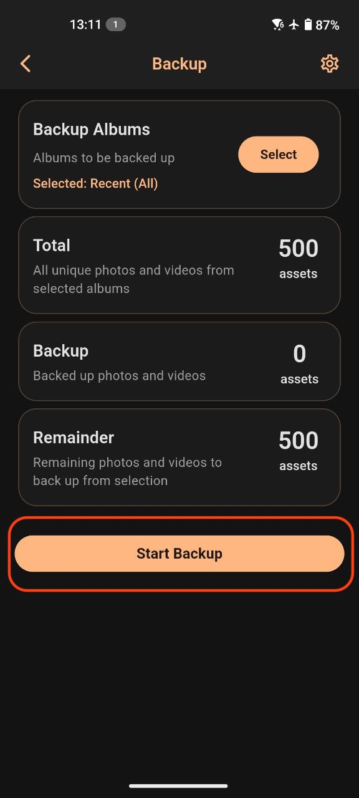

### Android
2. Актуальная версия приложения доступна [Загрузка](https://clickapp.fra1.cdn.digitaloceanspaces.com/Gallery/app-release_1.0.2+15.apk).
3. Установите его.
4. Запустите Cloud Gallery.
5. При первом запуске:
   - Разрешите доступ к медиафайлам.
    

6. Создайте учетную запись:

 

 
Ввести Ваш код активации, почту и пароль и нажать "Создать".

7. После входа:
   - В **Настройках** активируйте **Автозагрузку**.
 

 
 

 
   - Укажите папки для синхронизации.
   - Выберите режим передачи данных.
    

 
   - Включите фоновую работу приложения, чтобы загрузка не прерывалась.
     

 
---

## Рекомендации по эксплуатации
- Для экономии заряда батареи используйте загрузку только по Wi-Fi.
- При большом объёме медиа рекомендуется включить синхронизацию только при зарядке.
- Ограничьте доступ к своей учётной записи сложным паролем.

---

## Поддержка и устранение проблем
Если файлы не загружаются:
- Проверьте подключение к интернету.
- Проверьте, не заблокировано ли приложение энергосбережением (особенно на Android).
---
