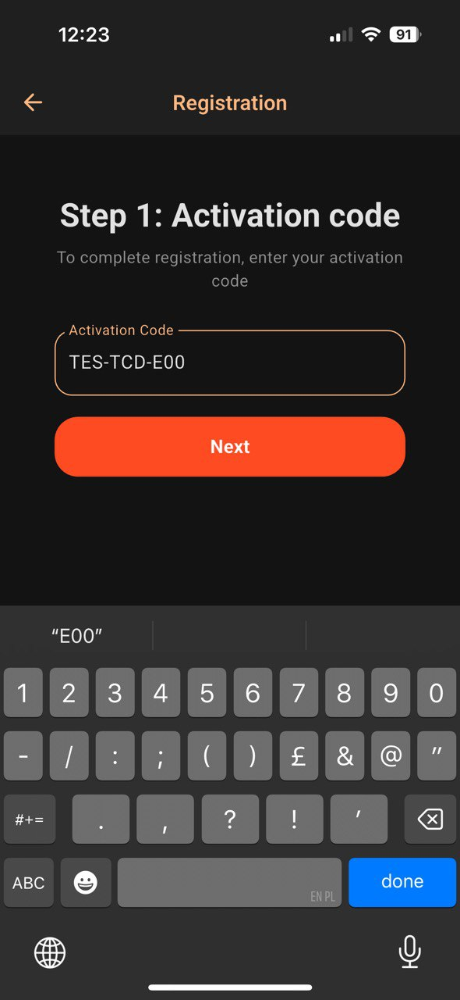
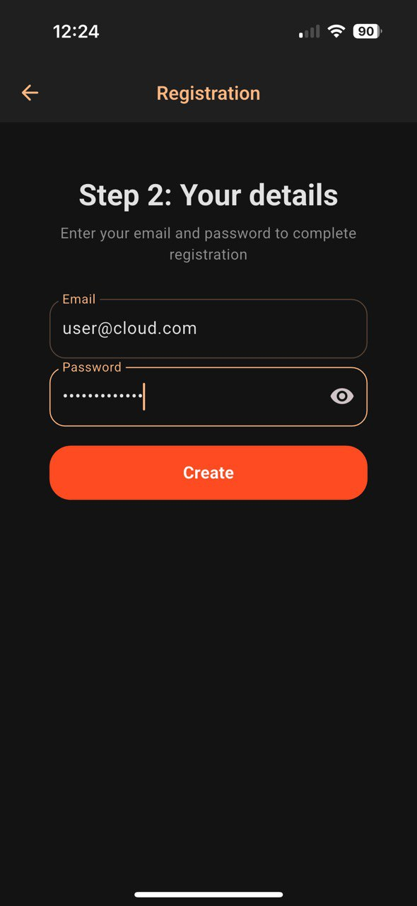

## Установка и первичная настройка

### iOS
1. Откройте **App Store**.
2. Актуальная версия приложения доступна в [AppStore](https://apps.apple.com/us/app/cloud-gallery-cloud-storage/id6744356849).
3. Установите приложение.
4. Запустите Cloud Gallery.
5. При первом запуске:
   - Разрешите доступ к фото/видео.

 

6. Создайте учетную запись:

 

 
Ввести Ваш код активации, почту и пароль и нажать конпку "Создать пользователя".

7. После авторизации:
   - Перейдите в **Настройки → Автозагрузка**.
   

 
   

 
   - Выберите папки для синхронизации.
   - Настройте условия загрузки (Wi-Fi / Wi-Fi + LTE).
   - При необходимости включите загрузку в фоновом режиме.
   

 
   

 

---

### Android
1. Откройте **Google Play**.
2. Актуальная версия приложения доступна в [Google Play](https://play.google.com/apps/testing/app.myclick.gallery).
3. Установите его.
4. Запустите Cloud Gallery.
5. При первом запуске:
   - Разрешите доступ к медиафайлам.
6. После входа:
   - В **Настройках** активируйте **Автозагрузку**.
   - Укажите папки для синхронизации.
   - Выберите режим передачи данных.
   - Включите фоновую работу приложения, чтобы загрузка не прерывалась.

---

## Рекомендации по эксплуатации
- Для экономии заряда батареи используйте загрузку только по Wi-Fi.
- При большом объёме медиа рекомендуется включить синхронизацию только при зарядке.
- Ограничьте доступ к своей учётной записи сложным паролем.

---

## Поддержка и устранение проблем
Если файлы не загружаются:
- Проверьте подключение к интернету.
- Проверьте, не заблокировано ли приложение энергосбережением (особенно на Android).
---
