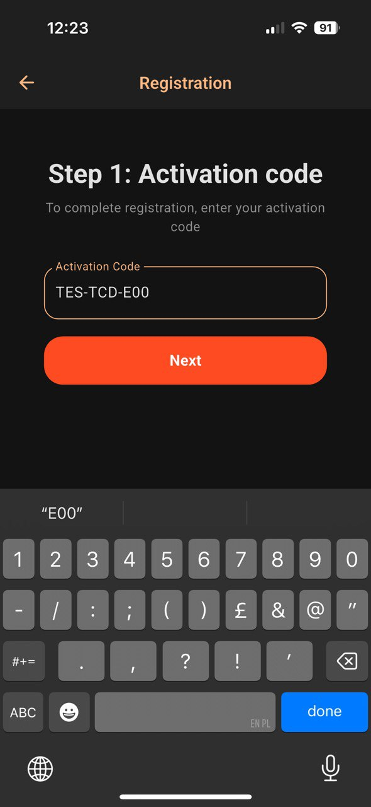
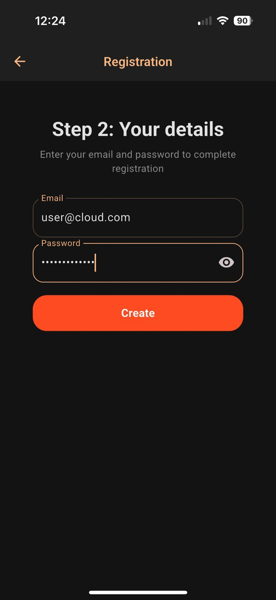

### iOS
1. Откройте **App Store**.
2. Актуальная версия приложения доступна в [AppStore](https://apps.apple.com/us/app/cloud-gallery-cloud-storage/id6744356849).
3. Установите приложение.
4. Запустите Cloud Gallery.
5. При первом запуске:
   - Разрешите доступ к фото/видео.

 

6. Создайте учетную запись:

 

 
Ввести Ваш код активации, почту и пароль и нажать "Создать".

7. После авторизации:
   - Перейдите в **Настройки → Автозагрузка**.
   

 
   

 
   - Выберите папки для синхронизации.
   - Настройте условия загрузки (Wi-Fi / Wi-Fi + LTE).
   - При необходимости включите загрузку в фоновом режиме.
   

 
   

 

---