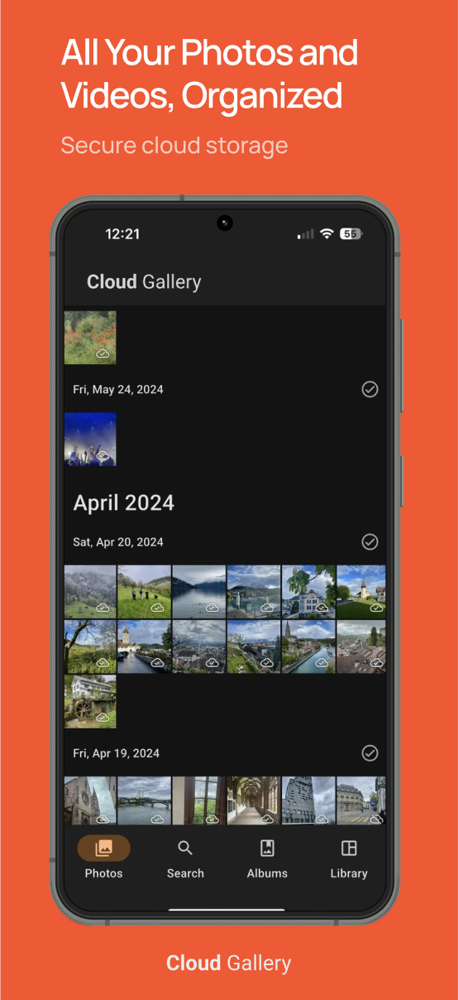

**Cloud Gallery** — это сервис для автоматической загрузки, централизованного хранения, организации и просмотра фотографий и видео, сделанных на мобильных устройствах.  
Приложение предназначено для пользователей, которые хотят сохранить свои медиафайлы в облаке, сохраняя полный контроль над данными и доступом к ним.  

 

[Cloud Gallery iOS](https://apps.apple.com/us/app/cloud-gallery-cloud-storage/id6744356849) | [Cloud Gallery Android](https://play.google.com/apps/testing/app.myclick.gallery)

## Системные требования

> * Версия ОС: iOS или iPadOS 15.0 или Android 9.0 и выше

---

## 2. Основные возможности

### 2.1. Автоматическая загрузка медиа
- Фоновой режим синхронизации: новые фото и видео автоматически загружаются в облако.
- Выбор папок для синхронизации.
- Настройки по типу соединения:
  - Только Wi-Fi.
  - Wi-Fi + мобильная сеть.
- Возможность ограничить загрузку при низком заряде батареи.

### 2.2. Хранение и организация
- **Оригинальное качество** — файлы сохраняются без сжатия.
- Структурирование по дате съёмки и геолокации.
- Создание **альбомов**.
- Возможность добавления метаданных:
  - Описание.
  - Теги.
  - Географические данные.

### 2.3. Просмотр и поиск
- Галерея с постраничной или бесконечной прокруткой.
- Поиск по:
  - Дате.
  - Месту съёмки.
  - Имени альбома.
  - Меткам и тегам.
  - Распознанным лицам (если включено на сервере).
- Фильтрация по типу файла: фото, видео, формат.

### 2.4. Дополнительные функции
- Поддержка Live Photos (iOS).
- Поддержка RAW-форматов.
- Работа с видео в высоком разрешении (4K, HDR).

---