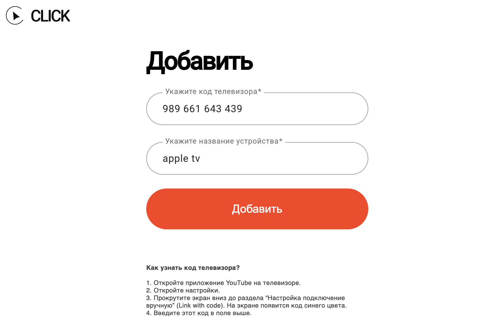

# Настройка CLICK на телевизорах

Перейди на сайт [tvclick.app](https://tvclick.app/), создайте аккаунт `или используйте данные которые Вы использовали при активации Android приложения`.

Ввести Вашу почту. Почта не обязательна должна совпадать с вашим Google аккаунтом.

 

Ввести Ваш код активации и нажмите активировать.

 

Для добавления вашего телевизора небходимо ввести **код** и **название телевизора**. 

 

Код телевизора можно узнать в **приложении YouTube на вашем телевизоре**, `Настройки → Настройки →  Подключение с помощью Кода`. На экране появится код **синего цвета**. Этот код меняется каждые несколько минут.

 

Название телевизора может быть любым.

Введите этот код и название в поля и нажмите кнопку ***Добавить***.

 

CLICK **настроен**. Чтобы удалить или добавить устройство, успользуйте личный кабинет tvclick.app и данный вашего аккаунта.

 

> В личном кабинете можно добавить до 3-х любых устройств (телевизоры, игровые консоли, TV приставки).
