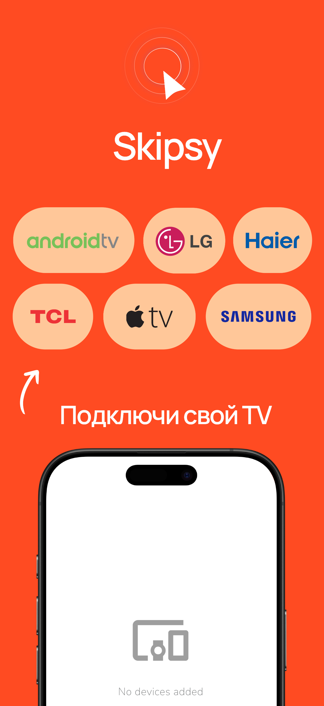
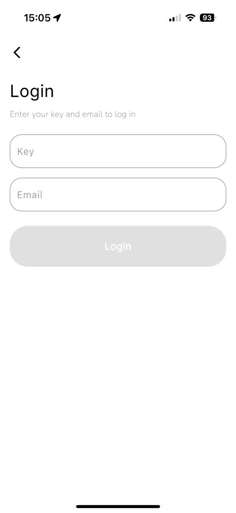
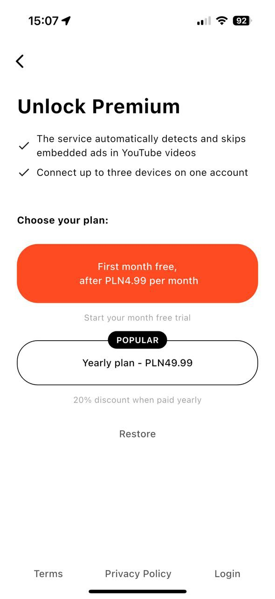
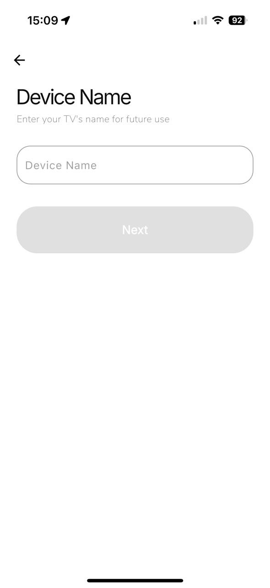
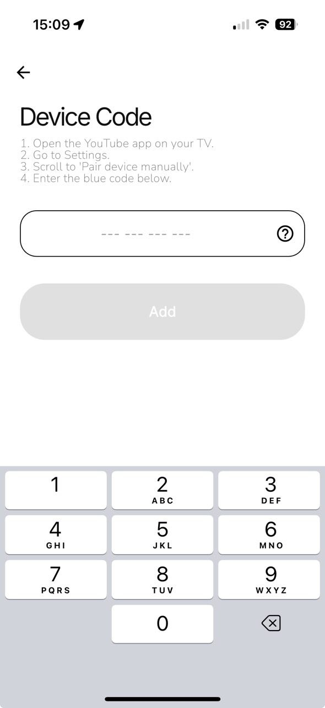
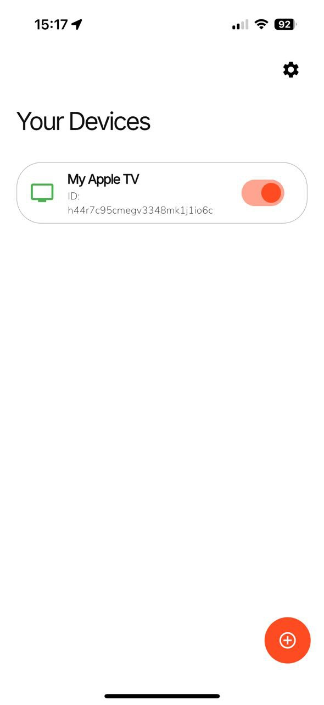

## Информация

> В этой статье рассказывается о Skipsy, приложение для iOS и Android — приложение использует AI для анализа структуры YouTube видео на вашем телевизоре и, автоматически пропускает спонсорские сегменты. Оно не вмешивается в рекламу YouTube и не нарушает правила платформы. Полный контроль остаётся за вами. [Skipsy iOS](https://apps.apple.com/us/app/skipsy/id6744373436) | [Skipsy Android](https://apps.apple.com/us/app/skipsy/id6744373436).

 

## Системные требования

> * Версия ОС: iOS или iPadOS 15.0 или Android 9.0 и выше

## Инструкции
- [Инструкция по настройке](/install_ios.md)

Приложение использует AI для анализа структуры YouTube видео на вашем телевизоре и, автоматически пропускает спонсорские сегменты. Оно не вмешивается в рекламу YouTube и не нарушает правила платформы. Полный контроль остаётся за вами.

## Преимущества

* Поддержка всех популярных ОС для Smart TV

`Apple TV, Roku TV, WebOS, Tizen и др.`

* Совместимость с более чем 100 брендами

`Samsung, LG, Sony, TCL, Roku, Panasonic, Philips, Toshiba, Hisense и др.`

* Без интеграций

`В роликах будут найдены и удалены рекламные интеграции от блогеров.`

## Использование

* Авторизация

Вы можете авторизировать, если у вас есть ключ доступа, перейти Настройки - Моя подписка - Авторизация:

Если у вас нет ключа доступа, вы можете купить подписку:

* Добавления устройства

Для добавления вашего телевизора небходимо нажать кнопку "Добавить устройство" и ввести название телевизора и код телевизора.
Название телевизора может быть любым.

Код телевизора можно узнать в приложении YouTube на вашем телевизоре, Настройки →  Подключение с помощью Кода. На экране появится код синего цвета. Этот код меняется каждые несколько минут.

* Готово! 

Skipsy настроен - теперь рекламные интеграции на этом телевизуоре будут пропущены автоматически!

> В приложении можно добавить до 3-х любых устройств (телевизоры, игровые консоли, TV приставки).
