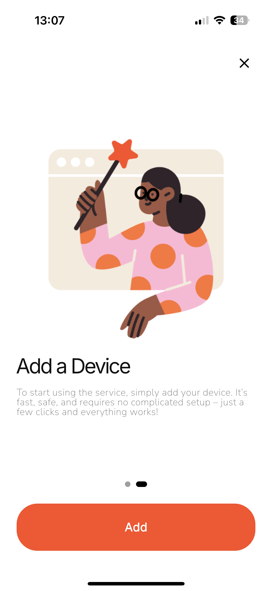
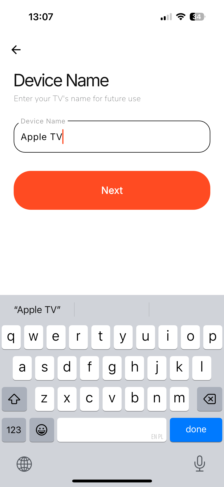
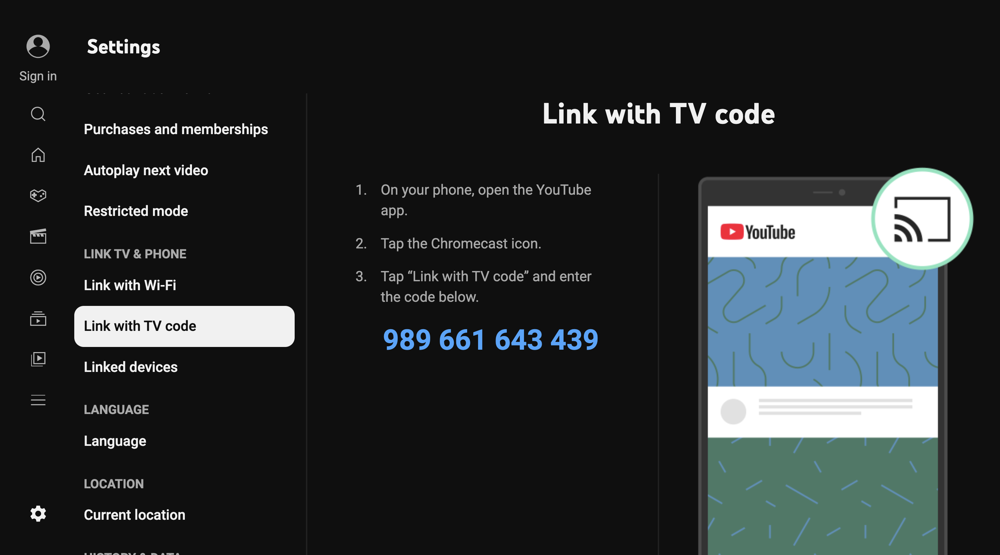
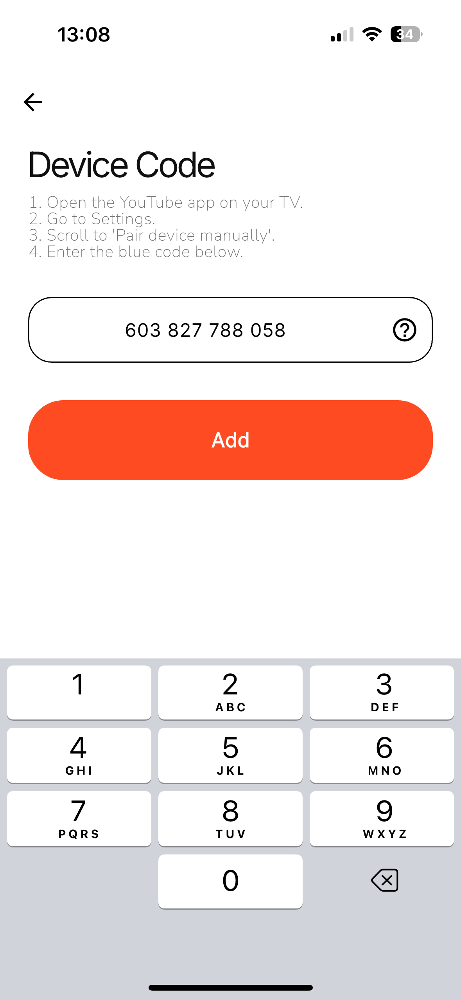
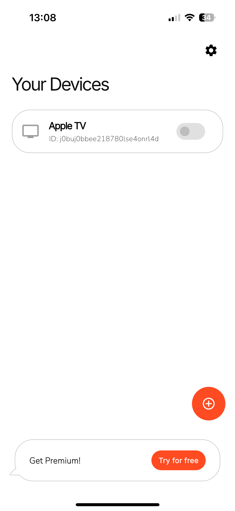
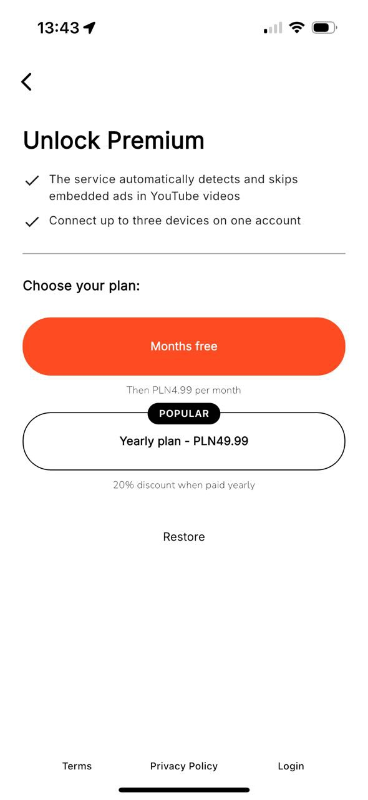
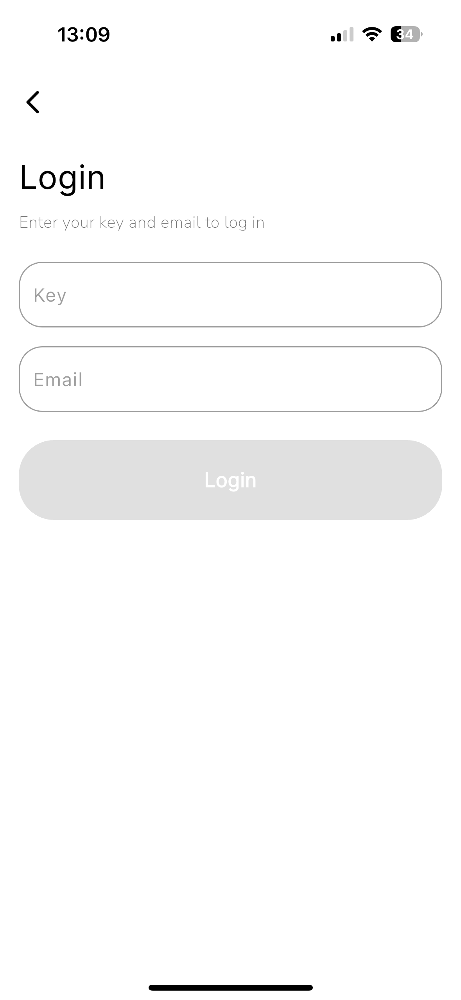
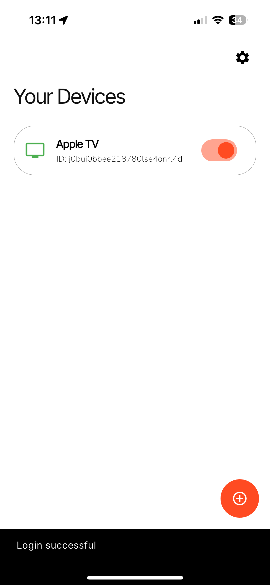

# 📱 Налаштування мобільного додатку

Щоб почати користуватися сервісом на телевізорі через мобільний пристрій, виконайте ці кроки:

---

## 1. Завантажте та відкрийте додаток

Завантажте мобільний додаток на свій смартфон і запустіть його.  
[Skipsy iOS](https://apps.apple.com/us/app/skipsy/id6744373436) | [Skipsy Android](https://play.google.com/store/apps/details?id=com.myclick.skipsy).

---

## 2. Натисніть кнопку Додати пристрій

На екрані **Ваші пристрої** натисніть кнопку ➕ у нижньому правому куті, щоб додати новий пристрій.

---

## 3. Введіть назву пристрою

Введіть назву для вашого телевізора (наприклад, Apple TV) і натисніть **Далі**.

---

## 4. Введіть код з додатку YouTube

На вашому телевізорі:

1. Відкрийте **додаток YouTube**.  
2. Перейдіть у **Налаштування**.  
3. Прокрутіть до **Підключити пристрій вручну**.  
4. Введіть **синій код** у додаток і натисніть **Додати**.

---

## 5. Пристрій додано

Ваш пристрій з’явиться у списку **Ваші пристрої**.  
Якщо ви користуєтесь безкоштовним планом, активним може бути лише один пристрій.

---

# 🔓 Розблокування Premium (необов’язково)

Щоб розблокувати всі функції (наприклад, кілька пристроїв):

1. Натисніть **Отримати Premium**.  
2. Виберіть свій тарифний план:  
   - Безкоштовний пробний період → далі 4.99 PLN/місяць  
   - **Річний план** → 49.99 PLN (знижка 20%)  
3. Завершіть покупку.

---

# 🔑 Увійдіть у свій обліковий запис

Щоб активувати Premium на іншому пристрої:

1. Натисніть **Увійти** внизу.  
2. Введіть свій **Ключ** та **Email**.  
3. Натисніть кнопку **Увійти**.

---

Після входу ви побачите повідомлення **Вхід успішний**, і ваш статус Premium буде активовано.

---

> Потрібна допомога? Зв’яжіться з нами — support@myclick.app
